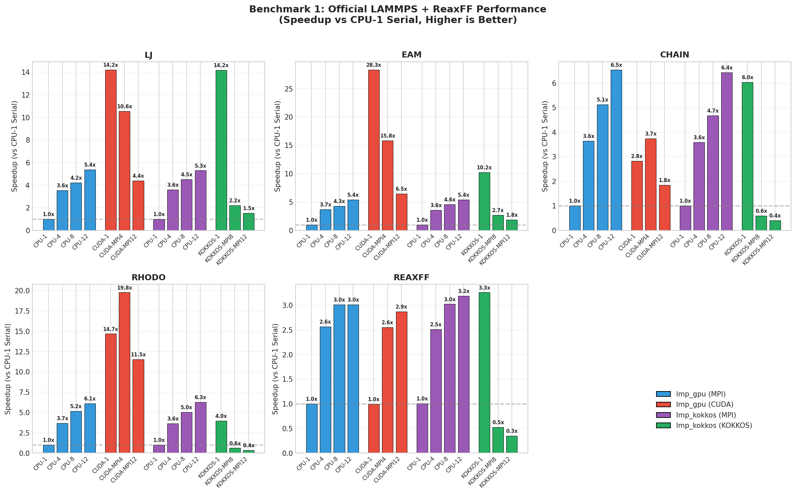
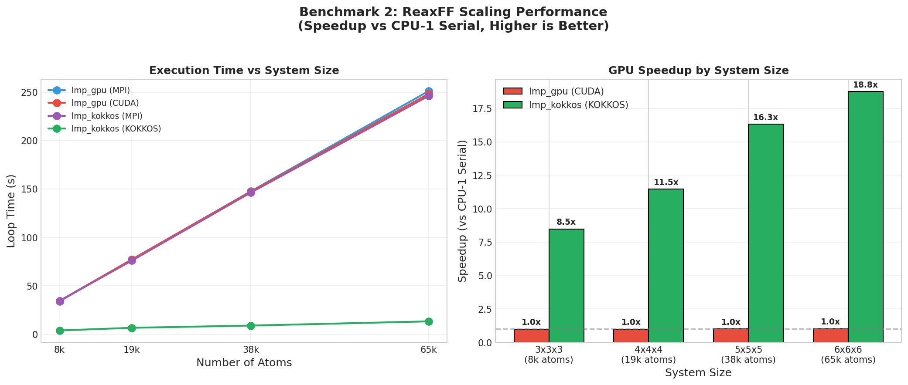

# LAMMPS Benchmark

[](summary_ko.md)

GPU & MPI acceleration benchmark for LAMMPS molecular dynamics simulations.

---

## Purpose

This repository contains benchmark results to **evaluate parallelization and GPU acceleration settings** for LAMMPS simulations. The primary focus is on **ReaxFF** reactive force field performance, as this is the main use case for this benchmark.

Key objectives:
- Compare CPU-only vs GPU-accelerated performance
- Evaluate CUDA GPU package vs KOKKOS GPU acceleration
- Analyze scaling behavior with increasing system sizes
- Identify optimal configurations for ReaxFF simulations

---

## Benchmark Systems

### 1. Official LAMMPS Benchmarks
Standard benchmark problems from the [LAMMPS benchmark suite](https://www.lammps.org/bench.html):

| Benchmark | Description |
|-----------|-------------|
| **LJ (Lennard-Jones)** | Atomic fluid with Lennard-Jones potential |
| **Chain (Polymer)** | Bead-spring polymer melt of 100-mer chains |
| **EAM (Metal)** | Metallic solid with EAM potential |
| **Chute (Granular)** | Granular chute flow |
| **Rhodo (Protein)** | Rhodopsin protein in solvated lipid bilayer |

### 2. ReaxFF VOH System (Primary Focus)
[Vanadium Oxide Hydroxide (VOH) system](https://github.com/ovilab/atomify-lammps-examples/tree/master/examples/reaxff/VOH) using the ReaxFF reactive force field.

> **Note**: ReaxFF is computationally expensive, with the main bottleneck typically in the **QEq (charge equilibration)** calculations. KOKKOS acceleration shows significant improvement for this workload.

> **Note**: Some pair styles (for example `snap`, `mliap` or `reaxff`) in the KOKKOS package have seen extensive optimizations and specializations for GPUs and CPUs. ([ref](https://docs.lammps.org/Speed_compare.html))

---

## Test Environment

### Hardware
| Component | Specification |
|-----------|---------------|
| **CPU** | Intel Core i9-12900 |
| **GPU** | NVIDIA RTX 3080 |
| **OS** | Windows (Docker Ubuntu container) |

### Software / Docker Images

| Software | Version |
|----------|---------|
| **LAMMPS** | 29 Aug 2024 - Update 3 |

Two Docker images were used to compare different GPU acceleration strategies:

| Image | Description | Dockerfile |
|-------|-------------|------------|
| **GPU (CUDA)** | LAMMPS with GPU package (CUDA acceleration) | [Dockerfile](https://github.com/kangmg/environment_archive/blob/main/maximal_lammps_gpu_env/Dockerfile) |
| **KOKKOS-GPU** | LAMMPS with KOKKOS package (CUDA backend) | [Dockerfile](https://github.com/kangmg/environment_archive/blob/main/maximal_lammps_gpu_kokkos_env/Dockerfile) |

---

## Benchmarks Performed

### Benchmark 1: Official LAMMPS + ReaxFF Performance Comparison
Comparison of execution time across different acceleration methods:
- CPU-only (serial)
- CPU with MPI parallelization
- GPU package (CUDA)
- KOKKOS-GPU (CUDA backend)

### Benchmark 2: ReaxFF Scaling Test
System size scaling test for the ReaxFF VOH system using replica expansion:

| Replica | Atoms (approx.) |
|---------|-----------------|
| 3×3×3 | ~8,000 |
| 4×4×4 | ~19,000 |
| 5×5×5 | ~38,000 |
| 6×6×6 | ~65,000 |

This test evaluates how GPU acceleration benefits scale with increasing system size.

---

## Results

All speedups are calculated relative to **CPU-1 Serial** (single-core, no GPU) baseline.

### Execution Groups

| Group | Description | Executable |
|-------|-------------|------------|
| **lmp_gpu (MPI)** | CPU-only with MPI parallelization | `lmp_gpu` |
| **lmp_gpu (CUDA)** | GPU acceleration via CUDA GPU package | `lmp_gpu -sf gpu -pk gpu 1` |
| **lmp_kokkos (MPI)** | CPU-only with MPI parallelization | `lmp_kokkos` |
| **lmp_kokkos (KOKKOS)** | GPU acceleration via KOKKOS (CUDA backend) | `lmp_kokkos -k on g 1 -sf kk` |

### Benchmark 1: Official LAMMPS + ReaxFF



#### Key Observations (Parsed from benchmark data)

| Benchmark | Best CPU (MPI) | Best CUDA GPU | Best KOKKOS GPU | Recommendation |
|-----------|----------------|---------------|-----------------|----------------|
| **LJ** | CPU-12 (5.30x) | CUDA-1 (14.22x) | KOKKOS-1 (14.18x) | CUDA/KOKKOS |
| **EAM** | CPU-12 (5.38x) | CUDA-1 (28.33x) | KOKKOS-1 (10.22x) | CUDA |
| **CHAIN** | CPU-12 (6.54x) | CUDA-MPI4 (3.74x) | KOKKOS-1 (6.03x) | CPU or KOKKOS |
| **RHODO** | CPU-12 (6.11x) | CUDA-MPI4 (19.77x) | KOKKOS-1 (3.96x) | CUDA |
| **REAXFF** | CPU-12 (3.02x) | CUDA-1 (0.99x) | KOKKOS-1 (3.26x) | **KOKKOS only** ⚠️ |

> ⚠️ **Important for ReaxFF**: CUDA GPU package provides **no acceleration** (0.99x), while KOKKOS provides 3.26x speedup. This is due to GPU-optimized QEq implementation in KOKKOS.

### Benchmark 2: ReaxFF Scaling



#### GPU Speedup by System Size (Parsed from benchmark data)

| System Size | Atoms | CPU-1 (s) | CUDA GPU-1 (s) | CUDA Speedup | KOKKOS GPU-1 (s) | KOKKOS Speedup |
|-------------|-------|-----------|----------------|--------------|------------------|----------------|
| 3×3×3 | 8,208 | 34.13 | 34.56 | 0.99x | 4.03 | **8.47x** |
| 4×4×4 | 19,456 | 77.21 | 77.30 | 1.00x | 6.74 | **11.46x** |
| 5×5×5 | 38,000 | 147.69 | 147.42 | 1.00x | 9.05 | **16.31x** |
| 6×6×6 | 65,664 | 251.10 | 248.23 | 1.01x | 13.39 | **18.75x** |

> 📈 **Key Finding**: KOKKOS GPU acceleration **scales with system size**. Larger systems benefit more from GPU acceleration (8.5x → 18.8x).

### Conclusions

1. **For simple potentials (LJ, EAM)**: Use CUDA GPU package for best performance
2. **For ReaxFF simulations**: **Must use KOKKOS** - CUDA GPU package has no effect (0.99x)
3. **ReaxFF scales well**: Larger systems get better GPU speedup (8.5x → 18.8x)
4. **Optimal ReaxFF config**: Single MPI rank + 1 GPU with KOKKOS

---

## Repository Structure

```
lammps_benchmark/
├── README.md / README_ko.md     # Documentation
├── figures/                     # Generated plots
│   ├── benchmark1_speedup.png
│   └── benchmark2_scaling.png
├── scripts/
│   └── analyze_benchmarks.py    # Analysis script
├── lammps_cuda_image/           # CUDA image results
└── lammps_kokkos_image/         # KOKKOS image results
```

---

## Command Reference

| Group | Alias | Command |
|-------|-------|---------|
| lmp_gpu (MPI) | CPU-1 | `lmp_gpu -in <input>` |
| lmp_gpu (MPI) | CPU-4 | `mpirun -np 4 lmp_gpu -in <input>` |
| lmp_gpu (MPI) | CPU-8 | `mpirun -np 8 lmp_gpu -in <input>` |
| lmp_gpu (MPI) | CPU-12 | `mpirun -np 12 lmp_gpu -in <input>` |
| lmp_gpu (CUDA) | CUDA-1 | `lmp_gpu -sf gpu -pk gpu 1 -in <input>` |
| lmp_gpu (CUDA) | CUDA-MPI4 | `mpirun -np 4 lmp_gpu -sf gpu -pk gpu 1 -in <input>` |
| lmp_gpu (CUDA) | CUDA-MPI12 | `mpirun -np 12 lmp_gpu -sf gpu -pk gpu 1 -in <input>` |
| lmp_kokkos (MPI) | CPU-1 | `lmp_kokkos -in <input>` |
| lmp_kokkos (MPI) | CPU-4 | `mpirun -np 4 lmp_kokkos -in <input>` |
| lmp_kokkos (MPI) | CPU-8 | `mpirun -np 8 lmp_kokkos -in <input>` |
| lmp_kokkos (MPI) | CPU-12 | `mpirun -np 12 lmp_kokkos -in <input>` |
| lmp_kokkos (KOKKOS) | KOKKOS-1 | `mpirun -np 1 lmp_kokkos -k on g 1 -sf kk -pk kokkos neigh half newton on -in <input>` |
| lmp_kokkos (KOKKOS) | KOKKOS-MPI8 | `mpirun -np 8 lmp_kokkos -k on g 1 -sf kk -pk kokkos neigh half newton on -in <input>` |
| lmp_kokkos (KOKKOS) | KOKKOS-MPI12 | `mpirun -np 12 lmp_kokkos -k on g 1 -sf kk -pk kokkos neigh half newton on -in <input>` |

---

## References

- [LAMMPS Official Benchmarks](https://www.lammps.org/bench.html)
- [ReaxFF VOH Example](https://github.com/ovilab/atomify-lammps-examples/tree/master/examples/reaxff/VOH)
- [LAMMPS GPU Package Documentation](https://docs.lammps.org/Speed_gpu.html)
- [LAMMPS KOKKOS Package Documentation](https://docs.lammps.org/Speed_kokkos.html)

