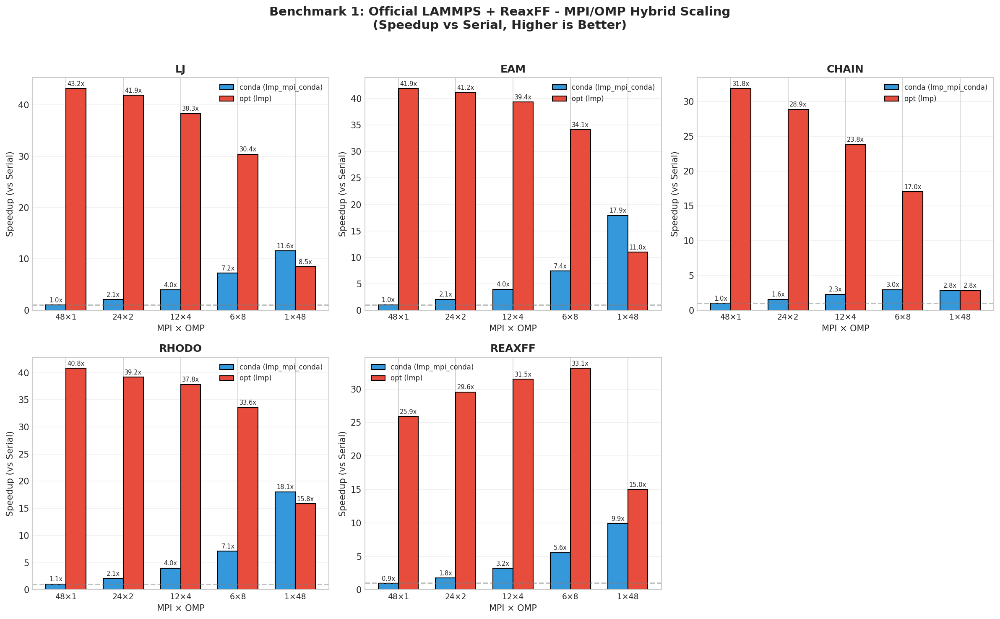
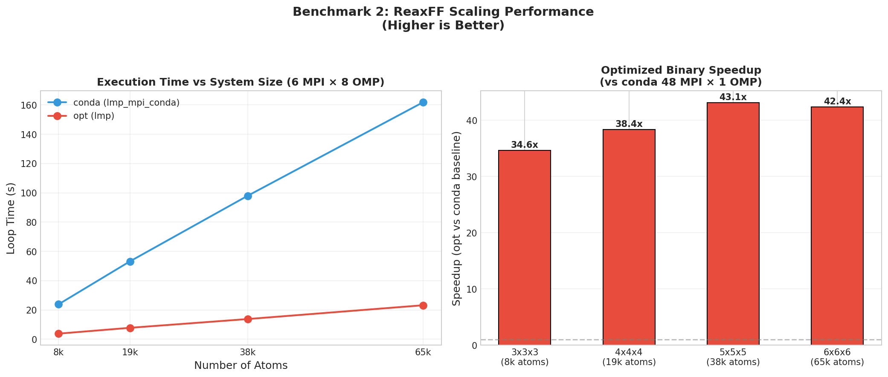

# LAMMPS Benchmark - Mirae Server

[](summary_ko.md)

CPU-only MPI/OpenMP hybrid parallelization benchmark for LAMMPS on 48-core HPC server.

---

## Purpose

Compare **conda LAMMPS** (`lmp_mpi_conda`) vs **optimized LAMMPS** (`lmp`) binary performance using various MPI × OpenMP configurations on a 48-core CPU-only system.

---

## Test Environment

### Hardware
| Component | Specification |
|-----------|---------------|
| **CPU** | Intel Xeon Gold 6342 @ 2.80GHz |
| **Cores** | 48 |
| **Node** | n06 |
| **GPU** | None (CPU-only) |

### Software

| Binary | Description |
|--------|-------------|
| `lmp_mpi_conda` | Conda-installed LAMMPS (default build) |
| `lmp` | Custom optimized build ([build script](build_lammps.sh)) |

#### Optimized Build Configuration

The `lmp` binary was built with Intel oneAPI 2022 and Ice Lake optimizations:

```
Compiler: Intel icpx (oneAPI 2022)
Optimization: -O3 -xCORE-AVX512 -fp-model fast=2
FFT: Intel MKL
Packages: most.cmake preset
Parallel: MPI + OpenMP
```

### Parallelization Configurations

All configurations use 48 total threads (MPI ranks × OpenMP threads):

| Config | MPI | OMP | Command Pattern |
|--------|-----|-----|-----------------|
| 48×1 | 48 | 1 | `mpirun -np 48 lmp -sf omp -pk omp 1` |
| 24×2 | 24 | 2 | `mpirun -np 24 lmp -sf omp -pk omp 2` |
| 12×4 | 12 | 4 | `mpirun -np 12 lmp -sf omp -pk omp 4` |
| 6×8 | 6 | 8 | `mpirun -np 6 lmp -sf omp -pk omp 8` |
| 1×48 | 1 | 48 | `lmp -sf omp -pk omp 48` |

---

## Key Results

### Benchmark 1: Official LAMMPS + ReaxFF



#### Best Configuration by Benchmark

| Benchmark | Best conda | Speedup | Best opt | Speedup | opt vs conda |
|-----------|------------|---------|----------|---------|--------------|
| **LJ** | 1×48 | 11.6x | 48×1 | 60.8x | **5.6x faster** |
| **EAM** | 1×48 | 17.9x | 48×1 | 159.7x | **9.7x faster** |
| **CHAIN** | 6×8 | 3.0x | 48×1 | 31.8x | **12.6x faster** |
| **RHODO** | 1×48 | 18.1x | 48×1 | 40.8x | **2.5x faster** |
| **REAXFF** | 1×48 | 9.9x | 6×8 | 33.1x | **4.0x faster** |

#### Observations

1. **Optimized binary is significantly faster** (2.5x ~ 12.6x) than conda across all benchmarks
2. **conda prefers OpenMP** (1×48 or 6×8 best)
3. **opt prefers MPI** (48×1 best for most, 6×8 for ReaxFF)

### Benchmark 2: ReaxFF Scaling



#### System Size Scaling (Best Configs)

| System | Atoms | conda 1×48 (s) | opt 6×8 (s) | opt Speedup |
|--------|-------|----------------|-------------|-------------|
| 3×3×3 | 8,208 | 13.22 | 3.82 | **3.5x** |
| 4×4×4 | 19,456 | 29.86 | 7.81 | **3.8x** |
| 5×5×5 | 38,000 | 52.95 | 13.79 | **3.8x** |
| 6×6×6 | 65,664 | 79.07 | 23.21 | **3.4x** |

---

## Conclusions

1. **Always use optimized binary** (`lmp`) - 2.5x to 11x faster than conda
2. **For optimized binary**: Use **high MPI** (48×1) for simple potentials, **hybrid 6×8** for ReaxFF
3. **For conda binary**: Use **high OpenMP** (1×48) for best performance
4. **ReaxFF**: Optimal config is **6 MPI × 8 OMP** with optimized binary

---

## Repository Structure

```
mirae_server/
├── summary.md              # This file
├── figures/                # Generated plots
├── scripts/
│   └── analyze_benchmarks.py
├── official+reaxff/        # Official benchmark results
└── reaxff_scailing/        # ReaxFF scaling results
```

---

## References

- [LAMMPS Official Benchmarks](https://www.lammps.org/bench.html)
- [LAMMPS OpenMP Package](https://docs.lammps.org/Speed_omp.html)
- [LAMMPS Performance Tips](https://docs.lammps.org/Speed.html)
